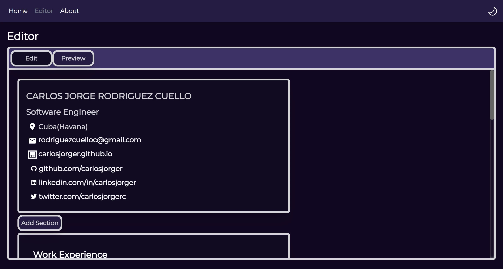
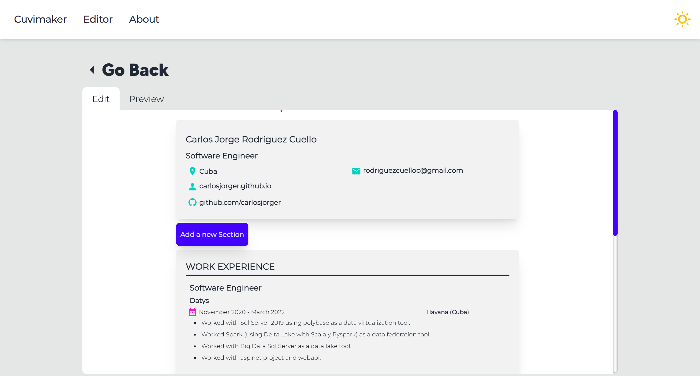
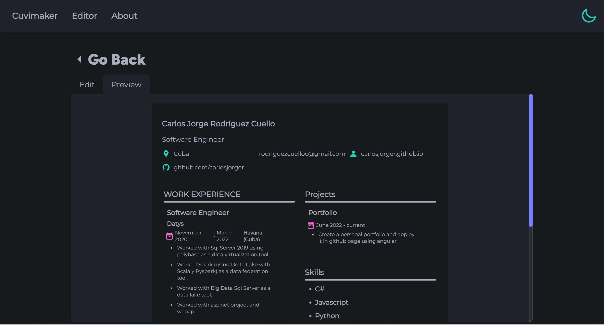
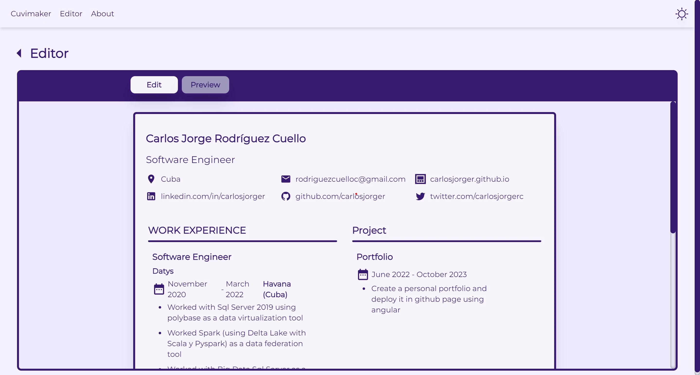

<h1 align="center">
    
   Cuvimaker  
</h1>
An online cv maker web application used to design a custom curriculum vitae and save it in a pdf file.

|                     Dark Mode 🌙                      |                        Light mode 🌞                         |
| :---------------------------------------------------: | :----------------------------------------------------------: |
|    |    |
|  |  |

## 🧰 Features

-   Versatile creation of CVs.
-   Light/dark mode.
-   Local Storage data persistence.
-   Responsive Design.
-   Download CV in PDF format.
-   Save at most 6 CVs.

## 🧞 Commands

All commands are run from the root of the project, from a terminal:

| Command           | Action                                       |
| :---------------- | :------------------------------------------- |
| `npm install`     | Installs dependencies                        |
| `npm run dev`     | Starts local dev server at `localhost:4321`  |
| `npm run build`   | Build your production site to `./dist/`      |
| `npm run preview` | Preview your build locally, before deploying |

## :iphone:Technologies

-   Astro
-   Vue3
-   Tailwind
